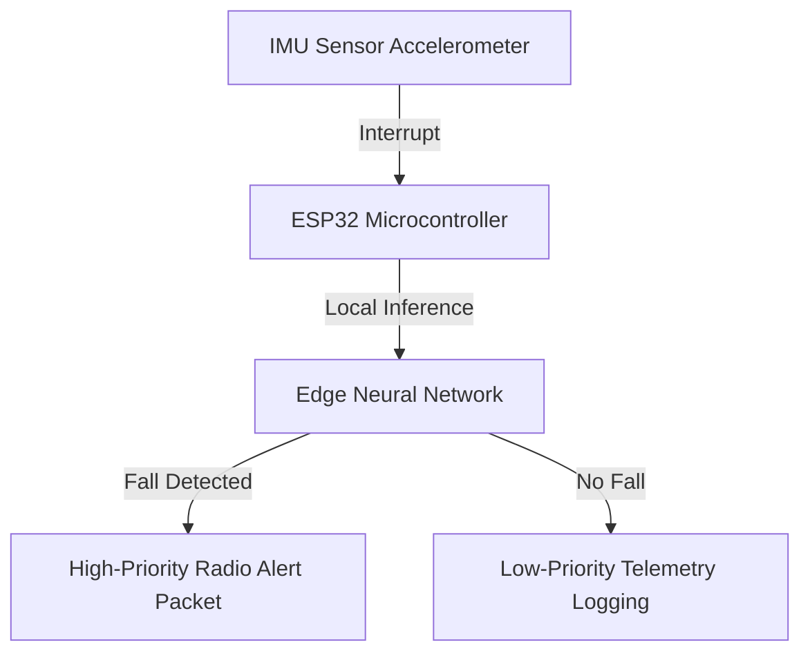

# 👷 Mine Safety Edge-AI: ESP32 Fall Detection & Telemetry System
    

## 📋 Table of Contents
- [Project Overview](#🎯-project-overview)
- [What This Project Does](#🚀-what-this-project-does)
- [Key Innovation](#🔬-key-innovation)
- [Performance Highlights](#📊-performance-highlights)
- [Architecture](#🏗️-architecture)
- [Tech Stack](#🧱-tech-stack)
- [Quick Start](#💻-quick-start)

---

## 🎯 Project Overview
An edge safety system deploying deterministic ML fall-detection models directly on ESP32 microcontrollers with a memory footprint under 128KB. Features event-driven C++ firmware that prioritizes alert transmission packets over telemetry updates during latency-critical hazard events.

---

## 🚀 What This Project Does
* **The Challenge:** Transmitting raw sensor telemetry from mines to the cloud for hazard analysis requires high bandwidth, incurs latency, and fails completely under network blackouts.
* **Our Solution:** Edge fall-detection running local neural models directly on the miner's wearable ESP32, transmitting alerts instantly over local communication bridges.

---

## 🔬 Key Innovation
| Feature | Traditional Cloud IoT ❌ | ESP32 Edge AI ✅ | Benefit |
|---------|--------------------------|------------------|---------|
| **Classification** | Heavy cloud pipelines | **ESP32 deterministic neural net** | 0ms network classification latency |
| **Footprint** | High megabyte RAM consumption | **Local <128KB static footprint** | Runs on ultra-low-power microcontrollers |
| **Firmware** | Standard round-robin loops | **Event-driven interrupt priority** | Alerts take priority over raw telemetry |

---

## 📊 Performance Highlights
- ✅ **Continuous fall classification** running locally.
- ✅ **Event-driven firmware** securing priority packets.
- ✅ **Simulated and verified** using MATLAB and Simulink models.

---

## 🏗️ Architecture


---

## 🧱 Tech Stack
- ESP32 microcontrollers (C++ PlatformIO / Arduino IDE)
- MATLAB & Simulink for data simulation and model verification
- Analog & digital sensors (accelerometers, gyroscopes, gas detectors)

---

## 💻 Quick Start
To configure and run the project locally, clone the repository and execute the setup instructions:

```bash
git clone https://github.com/Raghuram-sekar/Mine-Safety-Edge-AI.git
cd Mine-Safety-Edge-AI

# Execute local setup commands:
# Open project in PlatformIO or Arduino IDE
# Upload firmware/firmware.ino to ESP32 board
```
