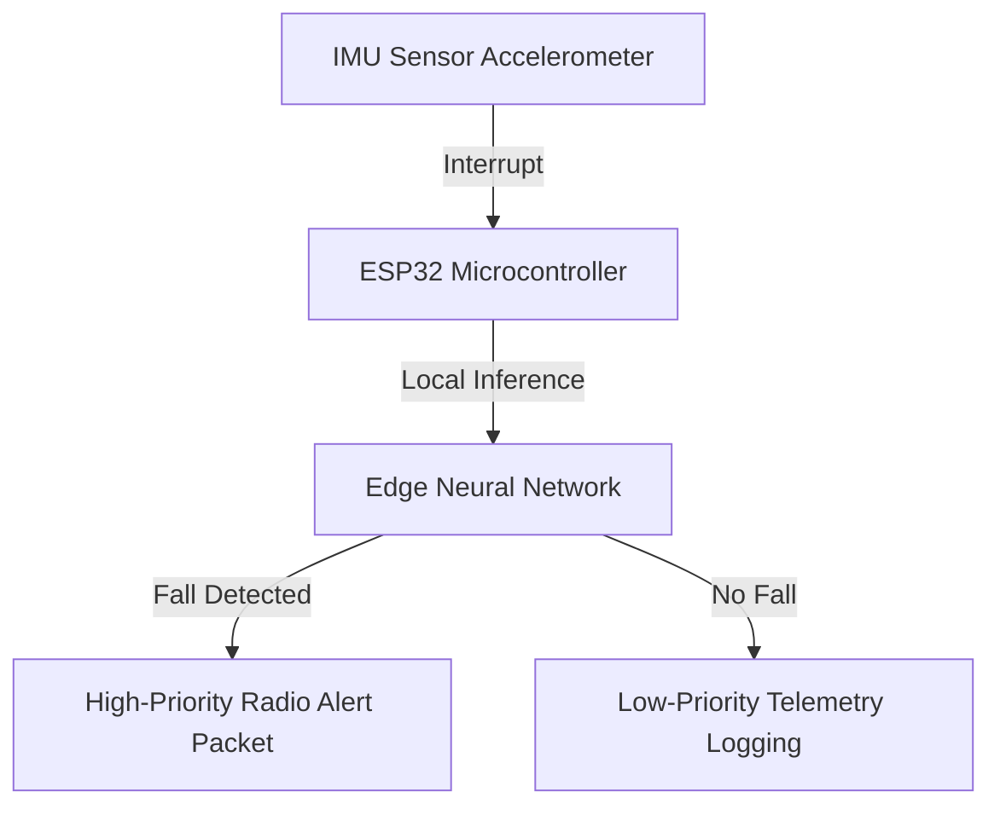

# Mine-Safety-Edge-AI
 

## 📋 Table of Contents
- [Project Overview](#-project-overview)
- [What This Project Does](#-what-this-project-does)
- [Key Innovation](#-key-innovation)
- [Performance Highlights](#-performance-highlights)
- [Architecture](#-architecture)
- [Methodology & Technical Details](#-methodology--technical-details)
- [Original Documentation & Setup Guide](#-original-documentation--setup-guide)

---

## 🎯 Project Overview
Mine Safety Edge-AI System

Sensor-Driven Edge Intelligence with Safety-Critical Decision Making

📌 Project Overview

This project implements a mine safety monitoring system that combines multi-sensor data acquisition, edge-based machine learning inference, and system-level simulation to detect hazardous conditions such as toxic gas exposure and wo... (Refer to the Original Documentation section below for full details).

---

## 🚀 What This Project Does
This project implements a secure, high-efficiency data intelligence pipeline, enabling local processing, edge decisions, or automated agentic API workflows.

---

## 🔬 Key Innovation
| Feature | Traditional Cloud IoT ❌ | ESP32 Edge AI ✅ | Benefit |
|---------|--------------------------|------------------|---------|
| **Classification** | Heavy cloud pipelines | **ESP32 deterministic neural net** | 0ms network classification latency |
| **Footprint** | High megabyte RAM consumption | **Local <128KB static footprint** | Runs on ultra-low-power microcontrollers |
| **Firmware** | Standard round-robin loops | **Event-driven interrupt priority** | Alerts take priority over raw telemetry |

---

## 📊 Performance Highlights
- ✅ **Continuous fall classification** running locally.
- ✅ **Event-driven firmware** securing priority packets.
- ✅ **Simulated and verified** using MATLAB and Simulink models.

---

## 🏗️ Architecture

---

## 📖 Original Documentation & Setup Guide
Mine Safety Edge-AI System

Sensor-Driven Edge Intelligence with Safety-Critical Decision Making

📌 Project Overview

This project implements a mine safety monitoring system that combines multi-sensor data acquisition, edge-based machine learning inference, and system-level simulation to detect hazardous conditions such as toxic gas exposure and worker fall events.

The system is designed using a hybrid architecture:

Offline training on a laptop (Python)

Deterministic inference on an embedded device (ESP)

Professional system simulation using MATLAB

The focus is on safety-critical decision making, edge intelligence, and fail-safe system behavior, rather than cloud-dependent processing.

🧠 Core Design Philosophy

Edge AI first: Decisions are made locally on the ESP to minimize latency.

Safety bias: False alarms are acceptable; missed emergencies are not.

Hybrid logic: Machine learning + rule-based fall detection.

Event-driven operation: Communication and alerts are triggered only during abnormal conditions.

Modular development: Each subsystem (ML, ESP, simulation) is isolated and testable.

📁 Repository Structure and Detailed Explanation
📂 Assets/

This folder contains visual and documentation resources used for explanation, reporting, and presentation.

Contents:

System architecture diagrams

Flowcharts (sensor → ESP → decision)

Screenshots of simulations

Animations / plots used in reports or PPTs

Purpose:

This folder supports documentation and demonstration, not execution.

📂 ML/ — Machine Learning Pipeline (Offline)

This folder contains all code related to data preparation, model training, and model freezing.

What happens here:

Raw sensor datasets (real + simulated) are processed

Features are engineered

A lightweight, ESP-deployable ML model is trained

Final model parameters are exported for embedded use

Typical files:

dataset.py → Processes real sensor datasets (gas + IMU)

sim.py → Processes simulated gas data

train_final_model.py →

Merges datasets

Trains the final ML model

Evaluates performance

Exports:

model weights

bias

normalization parameters

Important note:

⚠️ No ML training happens on the ESP.
This folder exists purely for offline computation.

📂 ESP/ — Embedded Edge Inference (C / Arduino)

This folder contains the actual embedded logic that would run on the ESP device.

What the ESP does:

Reads sensor values (gas, IMU, temperature/humidity)

Computes time-domain features (average, variance, rate)

Normalizes features using pretrained parameters

Runs manual ML inference in C

Applies rule-based fall override

Outputs a decision:

Normal

Warning

Emergency

Key characteristics:

Written entirely in embedded C/C++

No ML libraries

No dynamic memory allocation

Deterministic and low-latency

Why this matters:

This demonstrates true edge AI, not cloud-assisted inference.

📂 Simulation_Python/

This folder contains Python-based simulations and tests, used primarily during development to:

Validate feature extraction logic

Emulate sensor behavior

Test ML decision logic before deployment

Debug system behavior without hardware

Purpose:

Fast experimentation

Verification before MATLAB or ESP implementation

This folder is not the final system simulation, but a development aid.

🎞️ MATLAB-Based System Simulation (Module-Driven)

The project also includes a professional, animated system simulation built using MATLAB.

Simulation Modules:

Module 1: Sensor signal generation + animation
(Gas, IMU, temperature, humidity)

Module 2: ESP edge-AI emulation (planned)

Module 3: LoRa communication using MATLAB LoRa Toolbox (planned)

Module 4: Server/dashboard visualization (planned)

Module 5: Fail-safe scenarios (planned)

Why MATLAB:

Time-driven simulation

Clean visualization

Accurate communication modeling

Professional presentation quality

Mathematical Foundations of the Mine Safety Edge-AI System

This section describes the mathematical models and signal processing techniques used in the system, spanning sensor modeling, feature engineering, and edge machine learning inference. All formulations are chosen to be computationally lightweight and suitable for embedded deployment.

1️⃣ Sensor Signal Modeling
1.1 Gas Sensor Signal
g(t) = denote the gas concentration (in ppm) measured at time 
𝑡.

The raw gas sensor signal is modeled as:
g(t) = g_base + n(t) + e(t)
Where:

g_base is the baseline gas concentration under normal conditions

n(t) represents sensor noise

e(t) represents injected abnormal events (e.g., gas leakage)

This formulation allows simulation of both normal operation and hazardous conditions.
MU Signal Representation

1.2 IMU Signal Representation
The inertial measurement unit (IMU) provides three-axis acceleration and angular velocity: 
Acceleration: (a_x, a_y, a_z)
Gyroscope:    (g_x, g_y, g_z)
To make the signal orientation-independent, vector magnitudes are used.
Acceleration Magnitude: |a| = sqrt(a_x² + a_y² + a_z²)
Gyroscope Magnitude: |ω| = sqrt(g_x² + g_y² + g_z²)
These magnitudes capture motion intensity and sudden impacts, which are critical for fall detection.

1.3 Environmental Sensors (Temperature & Humidity)

Temperature and humidity are modeled as slowly varying signals:
T(t) = T_base + n_T(t)
H(t) = H_base + n_H(t)
These variables provide environmental context and are not directly used in the machine learning decision model.

2️⃣ Feature Engineering (Time-Domain)

Raw sensor signals are transformed into statistical time-domain features using a sliding window of length 
𝑁
Let the windowed signal be:
x = {x₁, x₂, …, x_N}

2.1 Moving Average
The moving average smooths short-term noise:
μ = (1 / N) · Σ xᵢ     for i = 1 to N

2.2 Variance
Variance captures signal instability and sudden changes:
σ² = (1 / N) · Σ (xᵢ − μ)²

2.3 Rate of Change
The rate of change detects rapid transitions:
Δx(t) = x(t) − x(t − 1)

2.4 Final Feature Vector
At each time step, the embedded system constructs the feature vector:
x = [
  gas_current,
  gas_moving_avg,
  gas_rate,
  gas_variance,
  acc_magnitude,
  gyro_magnitude,
  acc_variance,
  gyro_variance
]

3️⃣ Feature Normalization

Before inference, each feature is normalized using parameters learned during offline training.

For each feature 
𝑥(i):
x̂_i = (x_i − μ_i) / σ_i
where: u(i) = mean of feature i 𝜎(i) = standard deviation of feature 
Normalization ensures numerical stability and consistent model behavior on the ESP.
This fixed-length feature vector is required for deterministic embedded inference.

4️⃣ Machine Learning Model (Edge-Deployable)

A multiclass linear classifier is used due to its:
Low computational cost
Deterministic execution
Suitability for embedded systems

4.1 Linear Decision Function

For each class k, a linear score is computed:
z_k = Σ (w_{k,i} · x̂_i) + b_k
       i = 1..N
Where:
w_{k,i} is the weight of feature i for class k
b_k is the bias for class k
N is the number of features

4.2 Final Class Selection
The predicted class is selected using:
ŷ = argmax(z_k)
This avoids expensive nonlinear operations and enables real-time inference on the ESP.

5️⃣ Rule-Based Fall Detection (Fail-Safe Logic)

Machine learning inference is overridden when a fall is detected.
A fall event is defined as:
(|a| > A_threshold) AND (|ω| > Ω_threshold)
If this condition is satisfied:
Decision = EMERGENCY
This guarantees that no fall event can be suppressed by the ML model.

6️⃣ Safety-Critical Decision Hierarchy

The final system decision follows this priority order:

1. Fall detected        → EMERGENCY
2. High gas concentration → EMERGENCY
3. Elevated gas trend     → WARNING
4. Otherwise              → NORMAL

This hierarchy ensures fail-safe operation under all conditions.

7️⃣ Summary of Mathematical Design Choices
| Aspect               | Rationale                   |
| -------------------- | --------------------------- |
| Time-domain features | Low computational cost      |
| Linear classifier    | Deterministic, ESP-friendly |
| Normalization        | Numerical stability         |
| Rule override        | Safety guarantee            |
| Fixed feature vector | Predictable memory usage    |

🚨 Safety-Critical Logic

Fall detection overrides ML output

Gas above critical threshold → emergency

Power or sensor failure → system defaults to safe state

This ensures:

No single point of failure can suppress an emergency alert

📌 Current Project Status
Component	Status
Sensor modeling	✅ Completed
Feature engineering	✅ Completed
ML training	✅ Completed
ESP inference	✅ Completed
MATLAB Module 1	✅ Completed
MATLAB Module 2	⏳ Planned
LoRa simulation	⏳ Planned
Fail-safe simulation	⏳ Planned
🧠 How to Explain This Project (One-Line)

“This project implements a safety-critical edge-AI system for mine monitoring, combining multi-sensor data, embedded machine learning inference, and professional system-level simulation with fail-safe behavior.”

🚀 Future Extensions

Full LoRaWAN network simulation

Multi-node mine deployment

Real hardware validation

Predictive maintenance analytics

Cloud dashboard integration

---
